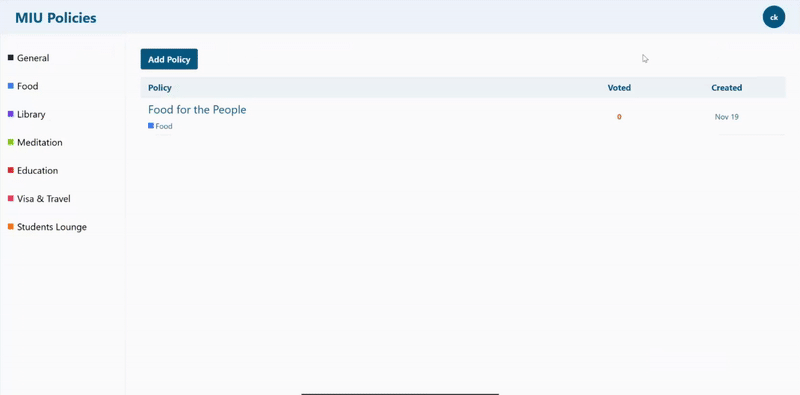

## CS472-Final-Project-November-2024 
### Policies for the Students: Policies for a Better Academic Experience
The requirements below are for the standalone project. For groups, please refer to the additional requirements section below.  
  
You will build a full-stack web application using React for the frontend and Express for the backend. The project will focus on state management, API interactions (REST), and component-based architecture.
* The application displays policies from all users by academic year.
* The application should provide ways to browse previous academic years (history).
* Guests can browse policies, but cannot add a new policy.
* Implement signup/signin and save the user state at the client.
* Only users can contribute and submit a new policy.
* A policy consists of a title, description, owner, date, and category (General, Food, Library, Meditation, Education, Visa & Travel, Students Lounge.. etc).
* A policy can be up-voted or down-voted by users, once per policy. Guests cannot up-vote or down-vote.
* Policies are sorted by vote in descending order.
* For the protected actions (Add policy, Up-Vote, Down-Vote), implement a middleware at the server to verify the user registration state.
  
## Frontend (React) Technical Requirements
* Create a well-structured component hierarchy.
* Use functional components and hooks (e.g., useState, useEffect, useContext).
* Utilize React Context API for passing global state between components.
* Implement controlled components for forms and inputs.
* Handle loading and error states appropriately.
* Design a user-friendly interface using a CSS framework (e.g., Tailwind CSS) or similar CSS libraries.
* Use React Router DOM to manage navigation.
  
## Backend (Express) Technical Requirements
* Create RESTful API endpoints to handle frontend requests and setup routes for different endpoints (e.g., GET, POST, PUT).
* Create a middleware to verify the user registration state before allowing access to the protected routes (add policy, up-vote, down-vote).
* Use morgan middleware for logging requests and handling errors.
* Use cors to allow communication between the frontend and backend applications on different ports.
* Use `node:fs` to store and manage the policies as files on the file system. If you have strong DBMS skills (for example [MySQL](https://www.npmjs.com/package/mysql2), you may use it for storage instead of node file system.

